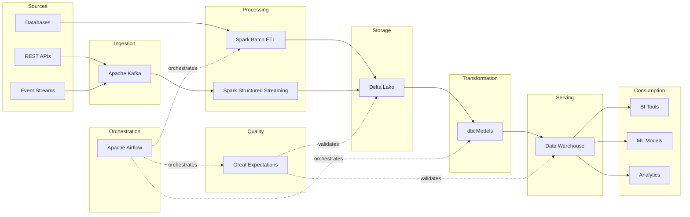

# Data Engineering Pipelines

Production-grade data engineering platform featuring PySpark ETL, Airflow orchestration, dbt transformations, and real-time streaming with Kafka. Built for scalability, reliability, and observability.

---

## Pipeline Architecture



## Tech Stack

| Component          | Technology                          |
|--------------------|-------------------------------------|
| Batch Processing   | Apache Spark 3.5 (PySpark)          |
| Stream Processing  | Spark Structured Streaming + Kafka  |
| Orchestration      | Apache Airflow 2.8                  |
| Transformation     | dbt-core 1.7                        |
| Storage            | Delta Lake 2.4                      |
| Data Quality       | Great Expectations 0.18             |
| Message Broker     | Apache Kafka 3.6                    |
| Schema Management  | Confluent Schema Registry           |
| Object Storage     | MinIO (S3-compatible)               |
| Containerization   | Docker & Docker Compose             |

## Features

- **Batch ETL**: PySpark jobs for extracting data from REST APIs and databases, applying complex transformations (window functions, sessionization, pivoting), and loading into Delta Lake with MERGE/upsert semantics.
- **Stream Processing**: Spark Structured Streaming consumers reading from Kafka topics with watermarking, windowed aggregations, and exactly-once Delta Lake writes.
- **Orchestration**: Airflow DAGs for daily ETL, data quality checks, and ML pipelines with SLA monitoring, Slack alerts, and task groups.
- **dbt Transformations**: Layered models (staging, intermediate, marts) with sessionization logic, SCD Type 2 dimensions, and comprehensive schema tests.
- **Data Quality**: Great Expectations suites and custom quality framework with null checks, uniqueness, referential integrity, regex patterns, and statistical anomaly detection.
- **Schema Registry**: Confluent Schema Registry integration for Avro/JSON schema management with compatibility enforcement.
- **CI/CD**: GitHub Actions workflow for linting, testing, dbt compilation, and Docker validation.

## Prerequisites

- Docker and Docker Compose (v2.20+)
- Python 3.10+
- Java 11 (for Spark)
- Make

## Getting Started

```bash
# Clone the repository
git clone https://github.com/srallabandi-cmd/data-engineering-pipelines.git
cd data-engineering-pipelines

# Start all services (Spark, Kafka, Airflow, PostgreSQL, Redis, MinIO)
docker-compose up -d

# Install Python dependencies
pip install -r requirements.txt

# Install dbt dependencies
cd dbt && dbt deps && cd ..

# Verify setup
make test
```

The Airflow UI will be available at `http://localhost:8080` (admin/admin).

## Project Structure

```
data-engineering-pipelines/
├── spark-jobs/
│   ├── etl/
│   │   ├── extract_api_data.py       # API extraction with retry logic
│   │   ├── transform_events.py       # PySpark transformations
│   │   └── load_warehouse.py         # Delta Lake upsert loading
│   └── utils/
│       ├── spark_session.py           # SparkSession builder
│       └── data_quality.py            # Custom quality framework
├── airflow/
│   ├── dags/
│   │   ├── daily_etl_pipeline.py      # Main ETL orchestration
│   │   ├── data_quality_checks.py     # Quality validation DAG
│   │   └── ml_pipeline_dag.py         # ML training pipeline
│   ├── plugins/
│   │   └── custom_operators.py        # Custom Airflow operators
│   └── docker-compose.yml             # Local Airflow deployment
├── dbt/
│   ├── models/
│   │   ├── staging/                   # Raw data cleaning
│   │   ├── intermediate/             # Business logic
│   │   └── marts/                    # Final dimensions & facts
│   ├── macros/                       # Custom macros & tests
│   ├── dbt_project.yml
│   └── profiles.yml
├── data-quality/
│   └── great_expectations/
│       ├── expectations/             # Expectation suites
│       └── checkpoints/              # Validation checkpoints
├── streaming/
│   ├── kafka_producer.py             # Kafka event producer
│   ├── spark_streaming_consumer.py   # Structured Streaming consumer
│   └── schema_registry.py           # Schema Registry client
├── tests/                            # Unit and integration tests
├── docker-compose.yml                # Full local dev stack
├── Makefile                          # Development commands
├── requirements.txt                  # Python dependencies
└── .github/workflows/
    └── test-pipelines.yml            # CI/CD pipeline
```

## Running Tests

```bash
# Run all tests
make test

# Run specific test suite
pytest tests/ -v --tb=short -k "test_transform"

# Run dbt tests only
cd dbt && dbt test

# Lint code
make lint
```

## Running the Pipeline

```bash
# Run batch ETL end-to-end
make run-etl

# Run dbt transformations
make run-dbt

# Start streaming pipeline
make run-streaming

# Or use Airflow to orchestrate everything
# Navigate to http://localhost:8080 and enable the daily_etl_pipeline DAG
```

## Contributing

1. Fork the repository
2. Create a feature branch (`git checkout -b feature/my-feature`)
3. Write tests for your changes
4. Ensure all tests pass (`make test`) and code is formatted (`make lint`)
5. Commit your changes following [Conventional Commits](https://www.conventionalcommits.org/)
6. Push to your branch and open a Pull Request

## License

MIT License. See [LICENSE](LICENSE) for details.
