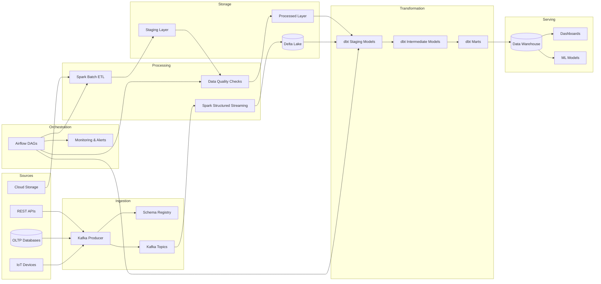

# Data Engineering Pipelines

[](https://spark.apache.org/)
[](https://airflow.apache.org/)
[](https://www.getdbt.com/)
[](https://kafka.apache.org/)
[](https://greatexpectations.io/)
[](LICENSE)

Production-grade data engineering platform featuring batch and streaming ETL pipelines, data quality validation, dimensional modeling, and ML workflow orchestration.

## Architecture



## Features

- **Batch ETL**: PySpark jobs with API extraction, complex transformations, and warehouse loading
- **Streaming**: Kafka producers, Spark Structured Streaming consumers with exactly-once semantics
- **Schema Management**: Confluent Schema Registry with schema evolution (BACKWARD, FORWARD, FULL)
- **Data Quality**: Great Expectations suites, custom PySpark validation framework, freshness and anomaly checks
- **Orchestration**: Airflow DAGs for daily ETL, data quality, and ML pipelines with Slack alerting
- **Dimensional Modeling**: dbt models across staging, intermediate, and marts layers with SCD Type 2
- **CI/CD**: GitHub Actions for linting, testing, dbt compilation, and Docker build verification
- **Local Development**: Full Docker Compose stack with Kafka, Spark, PostgreSQL, MinIO, and Airflow

## Prerequisites

- Docker and Docker Compose v2.20+
- Python 3.10+
- Java 11 (for local Spark)
- GNU Make

## Quick Start

```bash
# Clone the repository
git clone https://github.com/<your-org>/data-engineering-pipelines.git
cd data-engineering-pipelines

# Start the full local stack
make setup
make docker-up

# Create Kafka topics
make kafka-topics

# Run the batch ETL pipeline
make spark-submit JOB=spark-jobs/etl/extract_api_data.py

# Run dbt models
make dbt-run

# Run tests
make test

# Tear down
make docker-down
```

## Project Structure

```
data-engineering-pipelines/
├── spark-jobs/
│   ├── etl/
│   │   ├── extract_api_data.py       # API extraction with retry logic
│   │   ├── transform_events.py       # Complex PySpark transformations
│   │   └── load_warehouse.py         # Warehouse loading with upsert/SCD
│   └── utils/
│       ├── spark_session.py           # Spark session builder
│       └── data_quality.py            # Custom DQ framework
├── airflow/
│   ├── dags/
│   │   ├── daily_etl_pipeline.py      # Main ETL orchestration
│   │   ├── data_quality_checks.py     # Post-ETL quality checks
│   │   └── ml_pipeline_dag.py         # ML training and deployment
│   ├── plugins/
│   │   └── custom_operators.py        # Custom Airflow operators
│   └── docker-compose.yml             # Local Airflow environment
├── dbt/
│   ├── dbt_project.yml
│   ├── profiles.yml
│   ├── models/
│   │   ├── staging/
│   │   │   ├── stg_events.sql
│   │   │   ├── stg_users.sql
│   │   │   └── schema.yml
│   │   ├── intermediate/
│   │   │   ├── int_user_sessions.sql
│   │   │   └── schema.yml
│   │   └── marts/
│   │       ├── dim_users.sql
│   │       ├── fct_events.sql
│   │       └── schema.yml
│   └── macros/
│       ├── generate_schema_name.sql
│       └── test_macros.sql
├── data-quality/
│   └── great_expectations/
│       ├── expectations/
│       │   └── events_suite.json
│       └── checkpoints/
│           └── daily_checkpoint.yml
├── streaming/
│   ├── kafka_producer.py
│   ├── spark_streaming_consumer.py
│   └── schema_registry.py
├── .github/
│   └── workflows/
│       └── test-pipelines.yml
├── docker-compose.yml                 # Full local dev stack
├── Makefile
├── .gitignore
└── README.md
```

## Components

### Spark ETL Jobs

The `spark-jobs/` directory contains PySpark applications for batch and streaming workloads:

- **extract_api_data.py** - Extracts data from REST APIs with exponential backoff retry, pagination, rate limiting, and schema enforcement. Writes to the staging layer as Parquet.
- **transform_events.py** - Applies complex transformations including window functions (lag, lead, row_number), session identification, pivot operations, UDFs, and data enrichment via joins.
- **load_warehouse.py** - Loads processed data into the warehouse using Delta MERGE for upserts, SCD Type 2 dimension handling, and post-load validation with checksums.

### Airflow DAGs

- **daily_etl_pipeline.py** - Full orchestration: sensor for data arrival, extraction, Spark transformations, dbt run, quality checks, Slack notifications.
- **data_quality_checks.py** - Post-ETL validation: Great Expectations checkpoints, SQL checks, freshness, volume anomalies.
- **ml_pipeline_dag.py** - ML workflow: feature computation, training, evaluation, conditional deployment via BranchPythonOperator.

### dbt Models

Three-layer architecture following the dbt best practices:

| Layer | Purpose | Materialization |
|-------|---------|-----------------|
| **Staging** | Source cleaning, type casting, dedup | Incremental |
| **Intermediate** | Business logic, sessionization | Ephemeral / Table |
| **Marts** | Dimensions and facts for analytics | Table |

### Streaming

- **kafka_producer.py** - Produces events to Kafka with JSON schema validation, delivery guarantees, and key-based partitioning.
- **spark_streaming_consumer.py** - Consumes from Kafka with watermarking, window aggregations, and Delta Lake output.
- **schema_registry.py** - Manages Avro/JSON schemas with compatibility enforcement.

## Configuration

All credentials and environment-specific configuration are managed via environment variables. See `.env.example` for the full list. Never commit secrets.

| Variable | Description |
|----------|-------------|
| `SPARK_MASTER` | Spark cluster URL |
| `KAFKA_BOOTSTRAP_SERVERS` | Kafka broker addresses |
| `WAREHOUSE_JDBC_URL` | Data warehouse JDBC connection |
| `S3_ENDPOINT` | S3-compatible storage endpoint |
| `AIRFLOW__CORE__EXECUTOR` | Airflow executor type |

## Contributing

1. Fork the repository
2. Create a feature branch (`git checkout -b feature/my-feature`)
3. Write tests for new functionality
4. Ensure all quality checks pass (`make lint && make test`)
5. Commit your changes following [Conventional Commits](https://www.conventionalcommits.org/)
6. Open a pull request with a clear description

## License

This project is licensed under the MIT License.
